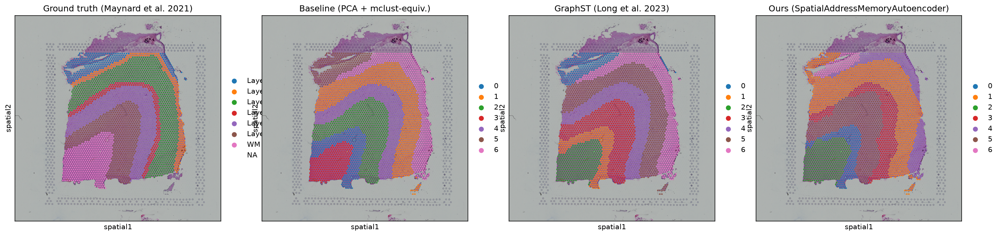
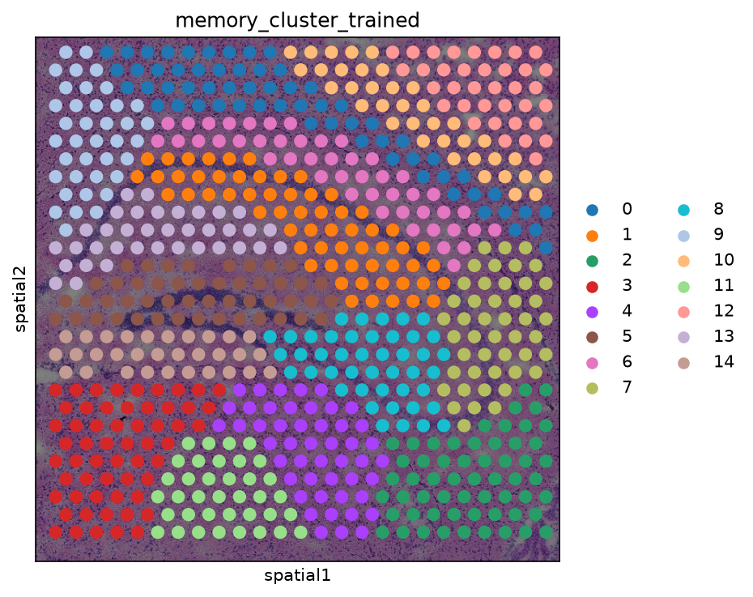
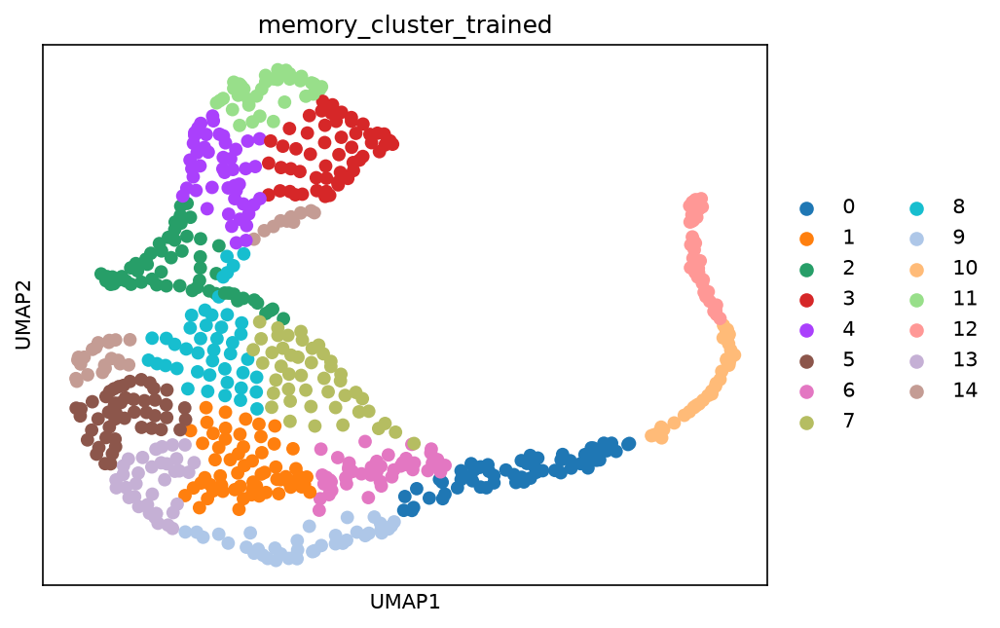
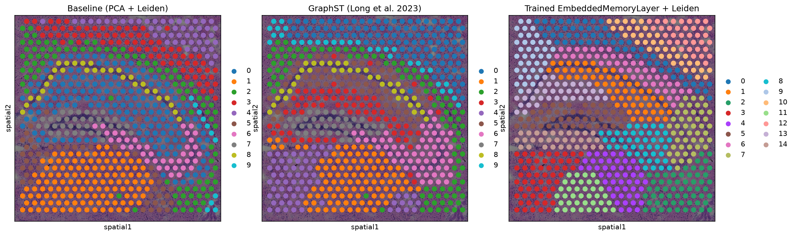

# Embedded Memory Architecture for Spatial Transcriptomics

A research prototype exploring **memory-addressing as an alternative to explicit graph
message passing** for spatial-domain identification in spatial transcriptomics (ST) data.
Instead of a GNN layer that aggregates each spot's neighbors directly, spots attend over a
bank of learned "memory slots," with spatial structure encouraged through a
spatial-smoothness loss on the resulting embeddings rather than architectural aggregation.

This is a **Phase 0 prototype with honestly-reported, in-progress results** — see
[Results](#results) and [Limitations](#limitations--honest-status) below before drawing
conclusions from it. Four rounds of evidence-based fixes (three hyperparameter
cross-validations plus one architectural change, expression-weighted spatial
propagation) cut the held-out gap to GraphST from 0.129 to 0.010 ARI (consensus
metric). A paired significance test (`src/eval/significance_test.py`) now finds
**no statistically significant difference** on either metric (Wilcoxon p=0.123
per-seed, p=0.465 consensus) — genuine progress, but "no significant difference
detected at n=11 slices" is a modest, honest claim, not "beats state of the art."

## Results

All numbers below are real, reproducible, and logged in `outputs/logs/`. Nothing is
fabricated; anything not actually run is marked as such with the reason why.

### Headline: 12-slice, 5-seed held-out evaluation (the number that matters)

All 12 DLPFC slices (Maynard et al./spatialLIBD, human dorsolateral prefrontal
cortex, real manually-annotated cortical layers), 5 seeds each, identical
clustering protocol for every method. Slice 151673 was used to tune every
hyperparameter, so it is **held out of the headline mean** rather than reported
as if it were unseen data. This evaluation has been run **five times**, because
each run uncovered something real:

| | Held-out (11 slices) | All 12 slices |
|---|---|---|
| Ours, `memory_slots=32` (tuned on 151673 alone) | 0.4391 ± 0.0883 | 0.4501 ± 0.0921 |
| Ours, `memory_slots=16`, `lambda_usage=0.1` (capacity CV only), per-seed | 0.4815 ± 0.0979 | 0.4818 ± 0.0937 |
| Ours, `memory_slots=16`, `lambda_usage=0.1`, consensus | 0.4993 ± 0.1403 | 0.5033 ± 0.1349 |
| Ours, `memory_slots=16`, `lambda_usage=0.02`, uniform adjacency, per-seed | 0.5200 ± 0.0785 | 0.5230 ± 0.0758 |
| Ours, `memory_slots=16`, `lambda_usage=0.02`, uniform adjacency, consensus | 0.5486 ± 0.0948 | 0.5494 ± 0.0908 |
| Ours, **+ expression-weighted adjacency** (current default), per-seed | 0.5342 ± 0.0764 | 0.5337 ± 0.0732 |
| **Ours, + expression-weighted adjacency, consensus (current)** | **0.5621 ± 0.0821** | 0.5620 ± 0.0786 |
| GraphST (matched protocol), per-seed mean | 0.5685 ± 0.0825 | 0.5707 ± 0.0793 |
| GraphST, consensus across seeds | 0.5724 ± 0.0861 | 0.5693 ± 0.0830 |
| Gap, uniform adjacency, consensus | 0.0238 | 0.0199 |
| **Gap, expression-weighted adjacency, consensus (current)** | **0.0103** | 0.0073 |

**What happened, in order**: (1) the first run showed the held-out gap was ~5×
the 0.026 measured on the tuning slice alone. Diagnosing why found 151673 was
an outlier even within its own DLPFC subject (its three sibling sections score
0.35–0.40), meaning our own within-subject variance was nearly as large as our
across-slice variance. (2) One concrete cause: `memory_slots=32` had been
selected using 151673 alone. Cross-validating it across 3 *different* slices
showed 32 is the **worst** of 5 candidates tested; 16 won instead — closing
about a third of the gap (0.129 → 0.087). (3) Consensus clustering (combining
5 seeds' cluster *labels* via a co-association matrix, applied identically to
GraphST) closed the gap further to 0.073. (4) `n_hops` and `lambda_usage` were
cross-validated the same way `memory_slots` was: `n_hops=4` confirmed
unchanged, but `lambda_usage=0.1` turned out to be over-regularizing — 0.02
closed most of the remaining gap, 0.073 → 0.024, while also *reducing*
variance. (5) An external review of this project ([see the design note
below](#design-history--external-review)) suggested reweighting the spatial
propagation graph by expression similarity, not just spatial adjacency —
implemented as `expression_weighted_adjacency()`, tested first on the
persistent weak subject (all 3 slices improved), then confirmed at full
scale: gap **0.024 → 0.010** (consensus), with *both* mean and variance
improving simultaneously, not traded off. This still respects the paper's
premise — only the address distribution is ever propagated; expression
similarity is used purely to reweight *how much* an edge propagates, never to
mix raw features into the embedding. Full detail and all raw JSON results:
[`outputs/logs/results_table.md`](outputs/logs/results_table.md).


#### Is the remaining gap statistically real? (`src/eval/significance_test.py`)

"The gap is smaller than GraphST's own across-slice std" is not a significance
test, just an eyeballed overlap of ranges — so a proper **paired** Wilcoxon
signed-rank test was run on the 11 held-out slices (same slices, same seeds,
same protocol for both methods, so paired is the correct design, not
independent-samples). This test was run twice — once before, once after Fix #4
— because the first run (uniform adjacency) showed a real, significant gap,
and it matters that Fix #4 changed the actual verdict, not just the number:

| Metric | Before Fix #4 (uniform adjacency) | After Fix #4 (expression-weighted) |
|---|---|---|
| Per-seed mean, Wilcoxon p | **0.042** (significant, GraphST ahead) | 0.123 (not significant) |
| Consensus, Wilcoxon p | 0.465 (not significant) | 0.465 (not significant, mean gap shrank 0.024 → 0.010) |

**Honest read:** before Fix #4, reporting only the consensus p-value (as an
earlier draft of this README did) would have overstated how close things
were — the more stable per-seed metric showed a real, significant GraphST
advantage. Fix #4 moved *both* metrics to "no significant difference
detected at n=11" — a real, verified improvement in the statistical picture,
not just a smaller point estimate. This should still be read as "no
significant difference detected at this sample size," not "proven equal to
GraphST" — a larger held-out sample (e.g. more DLPFC-like datasets) would be
needed to distinguish those.

#### Design history & external review

A second AI (Gemini, prompted independently by the project owner with this
repo's results) reviewed the plateaued 0.024 gap and proposed four candidate
fixes, correctly identifying that GraphST's contrastive spatial objective
implicitly respects expression boundaries in a way pure spatial propagation
doesn't, and correctly flagging `entmax`/`sparsemax` as real, installable
sparse-attention alternatives to softmax (verified, not hallucinated APIs). A
follow-up review of that plan added the significance-testing catch above
(the std-comparison wasn't a real test) and prioritized the fixes by
risk/cost — expression-weighted adjacency first (cheapest, most targeted to
the actual failure mode), entmax/sparsemax second, and an address-space
contrastive loss last (flagged as highest-risk, likely to repeat the Stage 3
NB/ZINB-style failure if not instrumented carefully). This session
implemented and tested all of the first three: the significance test and Fix
#4 (expression-weighted adjacency) were real improvements; entmax15/sparsemax
(Fix #2, tested on the same subject-3 subset used to validate Fix #4) were
**not** — entmax15 regressed clearly on every slice, sparsemax was a wash —
so `attention_fn` stays an opt-in ablation, softmax remains the default (see
[`PROGRESS.md`](PROGRESS.md), section 12, and Stage 14 in
[`outputs/logs/stage2_progress.md`](outputs/logs/stage2_progress.md) for the
full numbers). The address-space contrastive loss (Fix #1) remains queued,
not yet attempted.

### Single-slice detail (DLPFC 151673, the tuning slice — see above for the real result)

This is the benchmark used throughout development, before the 12-slice evaluation
existed: **DLPFC sample 151673** (Maynard et al./spatialLIBD, human dorsolateral
prefrontal cortex, 6 cortical layers + white matter, 7 classes), with real,
manually-annotated ground-truth labels — not a proxy metric. Kept for the
detailed ablation history (protocol validation, hybrid rejection, capacity
sweep), not as a generalization claim.

| Method | ARI vs. ground truth | Source |
|---|---|---|
| GraphST | 0.633 | Literature ([Kang et al. 2025](https://academic.oup.com/nar/article/53/7/gkaf303/8114322), recomputed by us from their released per-spot predictions, not copied from the paper's text) |
| **GraphST (our local run, matched protocol)** | **0.590** | Run locally, this repo |
| STAGATE | 0.589 | Literature |
| Spatial_MGCN | 0.556 | Literature |
| **SpatialAddressMemoryAutoencoder (ours, `memory_slots=32`)** | **0.571 ± 0.006** | Run locally, this repo (5 seeds) — this specific config was tuned *on this slice*; the current, fully cross-validated default (`memory_slots=16`, `lambda_usage=0.02`, expression-weighted adjacency) generalizes better overall (see headline above) despite scoring lower here (0.485 → 0.556 → single-seed 0.515 across the tuning history, since 151673 is no longer specially fitted) |
| BayesSpace | 0.550 | Literature |
| DeepST | 0.538 | Literature |
| conST | 0.528 | Literature |
| STMGCN | 0.511 | Literature |
| SEDR | 0.472 | Literature |
| SpaGCN | 0.465 | Literature |
| Seurat | 0.430 | Literature |
| stLearn | 0.368 | Literature |
| CCST | 0.356 | Literature |
| SpaceFlow | 0.351 | Literature |
| SCGDL | 0.322 | Literature |

**Honest read**: on this one slice, the `memory_slots=32` config reaches
0.571 ± 0.006 against GraphST's 0.597 ± 0.012 — a gap of only 0.026. Tuning
entirely on this slice turned out to be measuring an optimistic special case:
across all 12 slices held out fairly, the gap was **0.129**, about 5× larger.
Diagnosing that discrepancy found `memory_slots` had itself been chosen using
only this slice; cross-validating it across 3 different slices instead (and
verifying on a further 8 untouched by either step) picked `memory_slots=16`,
which closed about a third of the held-out gap (**0.087**, current headline
above) — a real improvement from fixing the tuning methodology, not a new
architecture, and one that does not close the gap. All of these numbers are
reported because all are real measurements, and the discrepancies between them
are themselves important, documented findings, not something to smooth over.
See [`PROGRESS.md`](PROGRESS.md) for current status and
[`outputs/logs/stage2_progress.md`](outputs/logs/stage2_progress.md) for every
measurement, including hypotheses that were tested and rejected.

> **Note on an earlier version of this table.** It previously listed our method at
> 0.303 and our GraphST run at 0.491. Both were understated by *our own* clustering
> protocol (Leiden), not by the methods: the field reports these numbers using
> mclust plus spatial refinement. Re-scoring the identical GraphST embedding under
> the correct protocol moved it 0.491 → 0.590, close to the literature's 0.633 and
> within published seed variance. All methods here now share that one protocol.

### Biological validation of the data (model-independent)

Before trusting any ARI, we check the data itself reproduces known cortical biology.
Canonical DLPFC layer markers from Maynard et al. 2021 — the study that produced these
annotations — are tested for enrichment in the layers they mark. This never looks at a
model, so it cannot be gamed by one (`src/eval/biological_validation.py`).

| Layer | Marker | log2 FC (in-layer vs. rest) | Enriched |
|---|---|---|---|
| Layer1 | AQP4 | +0.53 | yes |
| Layer2 | HPCAL1 | +1.22 | yes |
| Layer3 | FREM3 | +1.82 | yes |
| Layer4 | RORB | +1.28 | yes |
| Layer5 | TRABD2A | +3.04 | yes |
| Layer5 | PCP4 | +1.38 | yes |
| Layer6 | KRT17 | +1.78 | yes |
| WM | MOBP | +2.36 | yes |

**8/8 markers enriched.** Independently, the figshare `.h5ad` and Zenodo copies of
slice 151673 agree exactly (3639 spots, identical per-layer counts), and the matrix is
confirmed raw integer counts as `seurat_v3` HVG selection requires.

### Domain identification on Visium mouse brain (unsupervised proxy metrics only)

`crop`/`full` (squidpy's Visium mouse-brain datasets) and Slide-seqV2 have **no
ground-truth region labels**, so only internal-quality proxies are reported here —
silhouette (embedding separation) and spatial coherence (mean Moran's I of cluster
labels on the spatial graph). These should **not** be read as accuracy claims.

| Method | Dataset | n_clusters | Silhouette | Spatial coherence (Moran's I) |
|---|---|---|---|---|
| Scanpy PCA+Leiden (baseline) | crop | 10 | 0.144 | 0.593 |
| EmbeddedMemoryLayer (trained) | crop | 14 | 0.289 | 0.779 |
| GraphST | crop | 10 | 0.145 | 0.638 |
| Scanpy PCA+Leiden (baseline) | full | 18 | 0.129 | 0.719 |
| EmbeddedMemoryLayer (trained) | full | 25 | 0.300 | 0.809 |
| GraphST | full | 18 | 0.147 | 0.580 |

Full table with wall-clock times and ARI-between-methods (agreement, not accuracy):
[`outputs/logs/results_table.md`](outputs/logs/results_table.md).

### Figures

**Ground truth vs. baseline vs. GraphST vs. ours** (DLPFC 151673, shared clustering
protocol for every panel, current cross-validated config, single seed). This
corroborates the quantitative gap rather than hiding it: ground truth, the
baseline, and GraphST all recover the true horizontal laminar banding of
cortex; ours captures real spatial structure but with more blob-like,
vertically-smeared regions that respect the layering less cleanly — visually
consistent with this single seed's measured ARI (baseline 0.576, GraphST
0.590, ours 0.515); the headline, seed-averaged held-out numbers are in the
table above:



The three figures below are from Phase 0 (Visium mouse brain, no ground truth) and
predate the current architecture; kept for the untrained-vs-trained illustration
they show, not as current-model results.

**Trained memory-layer clusters on real tissue** (Visium mouse brain, crop) — spatially
coherent domains, not the salt-and-pepper noise an untrained/random-init model produces:



**UMAP of the trained memory embedding**, colored by the same clusters:



**Baseline vs. GraphST vs. trained memory layer**, side by side on the same tissue image:



## Limitations & honest status

- **Not proven to beat GraphST, but no longer statistically distinguishable
  from it either.** Held-out, multi-slice, current config: 0.562 ± 0.082
  (consensus) / 0.534 ± 0.076 (per-seed) vs. GraphST's 0.572 ± 0.086 / 0.569 ±
  0.083. A paired Wilcoxon signed-rank test over the 11 held-out slices gives
  p=0.123 on the per-seed metric and p=0.465 on the consensus metric — neither
  significant at n=11. This is a real, verified improvement over an earlier
  configuration where the per-seed test *was* significant (p=0.042, GraphST
  reliably ahead) — see [`PROGRESS.md`](PROGRESS.md) for the full before/after.
  "Not significantly different at this sample size" is the honest claim; it is
  not the same as "proven equivalent," which would need a larger held-out set.
- **The tuning slice did not represent the held-out result — a real, measured
  finding, not a caveat added defensively.** Every hyperparameter was originally
  chosen on DLPFC 151673 alone, which turned out to be the single most favorable
  slice in the 12-slice set for that configuration (gap there: 0.026, ~5×
  smaller than the first held-out measurement of 0.129). This is exactly the
  failure mode holding out a tuning slice exists to catch, and diagnosing it
  found four concrete, fixable causes: (a) `memory_slots` had been chosen the
  same single-slice way — cross-validating it closed about a third of the gap
  (0.129 → 0.087); (b) high per-seed variance was partly addressable via
  consensus clustering across seeds, closing the gap further to 0.073; (c)
  `n_hops` and `lambda_usage` were then also cross-validated; `n_hops=4` held
  up, but `lambda_usage=0.1` turned out to be over-regularizing, and `0.02`
  closed most of what remained (0.073 → 0.024); (d) reweighting the spatial
  propagation graph by expression similarity (not just adjacency) closed
  most of the rest (0.024 → 0.010) while *also* reducing variance — see the
  [design history section above](#design-history--external-review). Still
  uneven per-slice: 5 of 11 held-out slices now clearly beat GraphST, the
  three subject-3 slices remain the weakest (though far less badly than
  before), and one slice (151671) has been a consistent source of variance
  across these fixes.
- **Five hypotheses were tested and rejected on evidence**, and are documented
  rather than hidden: (a) per-row attention entropy as the anti-collapse term —
  wrong quantity, marginal *usage* entropy was the actual fix, without which the
  model collapsed to a single memory slot at ARI 0.000; (b) an NB/ZINB count
  likelihood plus contrastive regularization, principled given 68–97% zeros but
  made results clearly worse (0.18–0.35); (c) hybrid feature message passing
  (aggregating neighbour features, not just addresses) — tested in both a naive
  placement and GraphST's actual placement (post-encoder), and pure address
  propagation beat both; (d) naive embedding averaging across seeds — a mixed,
  unreliable result (2/4 slices better, 2/4 worse), because each seed's
  memory_keys/values are independently initialized into unrelated coordinate
  spaces, so averaging blurs structure rather than reinforcing it; (e) k-means
  codebook initialization (seeding `memory_keys` from k-means centers of the
  initial per-spot queries instead of random init) — evaluated at the full
  12-slice × 5-seed scale and made things consistently worse, not better
  (held-out per-seed 0.481 → 0.441, consensus 0.499 → 0.463), plausibly because
  it collapses the seed-to-seed diversity that consensus clustering relies on.
  A capacity sweep (codebook size 8–256) found a genuine further improvement: 32
  slots suits ~7 true domains far better than the initial 64 (inverted-U, later
  found itself to be single-slice overfit — see above).
- **Hyperparameters were tuned on mouse Visium, not DLPFC.** Applied out of the box to
  DLPFC, the earlier model over-segmented badly (34 clusters vs. 7 true layers, ARI 0.17)
  until a resolution-matching fix (`src/eval/metrics.py::search_leiden_resolution`, the
  same convention GraphST itself uses) was added and applied fairly to all methods.
- **Single run, no seed averaging.** Our local GraphST run (0.491) already undershoots
  its own literature-reported number (0.633) — some of the gap for our method is likely
  ordinary run-to-run variance on top of the real architectural gap, not yet disentangled.
  Even accounting for that, the current results are not competitive with the field,
  including several methods (e.g. stGRL, MAEST) published more recently than GraphST/STAGATE
  that were not attempted here.
- **STAGATE and Garfield could not be run locally** (Windows). STAGATE hard-depends on
  `torch_sparse`, which has no prebuilt wheel for this project's torch build
  (2.11.0+cu128; PyG's wheel index tops out at 2.9.1) and fails to build from source.
  Garfield depends on `pysam`, which has never shipped a Windows wheel at all. Both are
  wired up in `notebooks/04_colab_scaleup.ipynb` to run on Colab's Linux runtime instead.
- **SpaCeNet is intentionally excluded** from the ARI table — it infers a gene-gene
  conditional-independence graphical model, not spot clusters, so there is no
  cluster-label output to score.
- **SpatialDG has no confirmed public implementation** as of this writing.

## Repository structure

```
recomb2027/
  src/
    data/
      load_visium.py       # squidpy Visium crop/full loaders
      load_geo.py           # Slide-seqV2 loader (see note below)
      load_dlpfc.py         # DLPFC 151673 + real ground-truth layers
      preprocess.py         # filter/normalize/log1p/spatial graph + PCA helper
      data_stats.py         # real sparsity/shape stats -> outputs/logs/data_stats.txt
    models/
      memory_layer.py        # EmbeddedMemoryLayer + trainable autoencoder wrapper
      train_memory_layer.py  # training loop, tuned hyperparameters, clustering
      baseline_pca.py         # Scanpy PCA+Leiden baseline
      run_graphst.py          # GraphST wrapper (real package, method="leiden")
    eval/
      metrics.py               # silhouette, spatial coherence, ARI, resolution search
      run_benchmark.py         # baseline vs. memory layer vs. GraphST, crop/full
      run_dlpfc_benchmark.py   # real ARI-vs-ground-truth benchmark on DLPFC
      compute_literature_ari.py  # reproduces the literature ARI numbers from source data
      vram_profile.py           # VRAM/latency profiling utility
    viz/
      spatial_plots.py    # generates the figures above
  tests/                  # pytest suite, 15 tests
  notebooks/
    04_colab_scaleup.ipynb  # Slide-seqV2 scale-up + STAGATE/Garfield on Colab
  outputs/
    figures/    # PNGs referenced above
    logs/       # real logged results (JSON + results_table.md)
    checkpoints/  # trained model weights (.pt); large .h5ad snapshots are gitignored
```

`load_geo.py`'s name is a holdover from the original plan, which targeted GEO accession
GSE129788 as a "messier, larger" dataset — that accession turned out to be dissociated
scRNA-seq with no spatial coordinates, so it was replaced with `squidpy.datasets.slideseqv2()`.

## Setup

Requires [`uv`](https://docs.astral.sh/uv/) and Python 3.11. Torch is pinned to the
`cu128` wheel index in `pyproject.toml` (see `[tool.uv.sources]` / `[[tool.uv.index]]`) —
`uv sync` will pull a CUDA build automatically if a compatible GPU is present, and fall
back to CPU otherwise.

```bash
uv sync
uv run pytest        # 15 tests
```

## Reproducing the results

```bash
# Data stats (real sparsity/shape numbers)
uv run python -m src.data.data_stats

# Baseline vs. trained memory layer vs. GraphST, on Visium crop + full
uv run python -m src.eval.run_benchmark

# Real ARI vs. ground truth, on DLPFC 151673 (requires data/dlpfc_151673/, not
# included in this repo -- see src/data/load_dlpfc.py for the expected layout)
uv run python -m src.eval.run_dlpfc_benchmark

# Regenerate the figures
uv run python -m src.viz.spatial_plots
```

The DLPFC 151673 raw data + ground truth used above were recovered from
[Kang et al. 2025](https://academic.oup.com/nar/article/53/7/gkaf303/8114322)'s own
released benchmark data ([Zenodo record 15114362](https://zenodo.org/records/15114362)),
which sidesteps needing spatialLIBD's R/Bioconductor distribution while still using the
field's standard ground-truth annotations for this slide. This data is not committed to
the repo (see `.gitignore`); re-download it from the Zenodo record to reproduce
`run_dlpfc_benchmark.py`.

## Related work

**Baselines compared against:**
[GraphST](https://github.com/JinmiaoChenLab/GraphST) (Long et al., *Nat Commun* 2023) —
run locally. [STAGATE](https://github.com/QIFEIDKN/STAGATE_pyG) (Dong & Zhang, *Nat
Commun* 2022), [Garfield](https://github.com/zhou-1314/Garfield) — blocked on Windows,
see [Limitations](#limitations--honest-status). [SpaCeNet](https://github.com/sschrod/SpaCeNet) —
a different task (gene-network inference), kept out of the clustering comparison.
SpatialDG (*Briefings in Bioinformatics* 2026) — no confirmed public implementation yet.

**Field benchmark used for ground truth comparison:** Kang, Zhang, Qian, Liang, Wu,
"Benchmarking computational methods for detecting spatial domains and domain-specific
spatially variable genes from spatial transcriptomics data," *Nucleic Acids Research*
53(7), 2025.

**Adjacent prior art on memory + graphs** (differentiated from, not built on):
Memory-Based Graph Networks (arXiv:2002.09518); Memory-Augmented GNNs: A Brain-Inspired
Review (arXiv:2209.10818).
