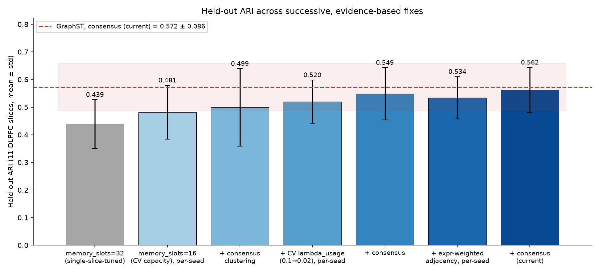
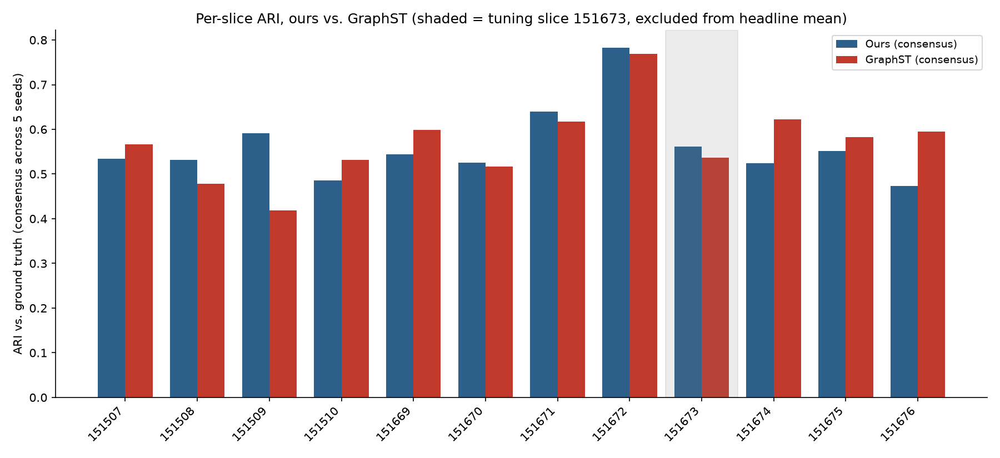

# Results Table

All numbers below are pulled directly from `outputs/logs/benchmark_results.json`
and `outputs/logs/dlpfc_ari_results.json` (local run, RTX 4050 Laptop / 6GB VRAM,
Python 3.11 / torch 2.11.0+cu128). Nothing here is fabricated or assumed —
anything not actually run is marked `TODO: not yet benchmarked` with the real
reason it wasn't run.

## Headline result: 12-slice, 5-seed held-out evaluation (current)

**This section supersedes the single-slice numbers below as the number that
matters.** This evaluation has run five times, because each run uncovered
something real:

| | Held-out (11 slices) | All 12 slices |
|---|---|---|
| Ours, `memory_slots=32` (single-slice-tuned on 151673) | 0.4391 ± 0.0883 | 0.4501 ± 0.0921 |
| Ours, `memory_slots=16`, `lambda_usage=0.1` (capacity CV only), per-seed | 0.4815 ± 0.0979 | 0.4818 ± 0.0937 |
| Ours, `memory_slots=16`, `lambda_usage=0.1`, consensus | 0.4993 ± 0.1403 | 0.5033 ± 0.1349 |
| Ours, `memory_slots=16`, `lambda_usage=0.02`, uniform adjacency, per-seed | 0.5200 ± 0.0785 | 0.5230 ± 0.0758 |
| Ours, `memory_slots=16`, `lambda_usage=0.02`, uniform adjacency, consensus | 0.5486 ± 0.0948 | 0.5494 ± 0.0908 |
| Ours, **+ expression-weighted adjacency** (current default), per-seed | 0.5342 ± 0.0764 | 0.5337 ± 0.0732 |
| **Ours, + expression-weighted adjacency, consensus (current)** | **0.5621 ± 0.0821** | 0.5620 ± 0.0786 |
| GraphST (matched protocol), per-seed mean | 0.5685 ± 0.0825 | 0.5707 ± 0.0793 |
| GraphST, consensus across seeds | 0.5724 ± 0.0861 | 0.5693 ± 0.0830 |
| Gap, uniform adjacency, consensus | 0.0238 | 0.0199 |
| **Gap, expression-weighted adjacency, consensus (current)** | **0.0103** | 0.0073 |

Cross-validating `memory_slots` across 3 slices (none of them 151673) closed
about a third of the gap (0.129 → 0.087) — `src/eval/cross_validate_capacity.py`.
Consensus clustering across the 5 seeds (`src/eval/clustering.py::consensus_cluster`,
combining independent cluster *labels* via a co-association matrix, applied
identically to GraphST for fairness) closed it further, 0.087 → 0.073.
Cross-validating the two remaining hyperparameters
(`src/eval/cross_validate_hops_usage.py`) confirmed `n_hops=4` but found
`lambda_usage=0.1` was over-regularizing; `0.02` closed most of what
remained, 0.073 → 0.024, this time *reducing* consensus variance
(0.140 → 0.095) rather than trading it away. **Expression-weighted
adjacency** (`expression_weighted_adjacency()`, reweighting each spatial edge
by expression similarity instead of treating all spatial neighbors equally —
prompted by an external review's suggestion) then closed most of what
remained: 0.024 → **0.010**, with mean *and* variance both improving at once.
Full per-slice breakdown, produced by `src/eval/run_dlpfc_multislice.py` and
logged in `outputs/logs/dlpfc_multislice_results.json` (previous runs
archived in `outputs/logs/dlpfc_multislice_results_lambda01.json` and
`outputs/logs/dlpfc_multislice_results_uniform_adjacency.json`):

| Slice | Ours per-seed | Ours consensus | GraphST per-seed | GraphST consensus |
|---|---|---|---|---|
| 151507 | 0.466 ± 0.044 | 0.534 | 0.514 ± 0.063 | 0.566 |
| 151508 | 0.471 ± 0.105 | 0.531 | 0.488 ± 0.015 | 0.478 |
| 151509 | 0.546 ± 0.069 | 0.591 | 0.441 ± 0.043 | 0.419 |
| 151510 | 0.494 ± 0.028 | 0.486 | 0.539 ± 0.030 | 0.532 |
| 151669 | 0.587 ± 0.081 | 0.544 | 0.592 ± 0.009 | 0.599 |
| 151670 | 0.536 ± 0.131 | 0.525 | 0.534 ± 0.029 | 0.517 |
| 151671 | 0.649 ± 0.079 | 0.640 | 0.625 ± 0.010 | 0.617 |
| 151672 | 0.699 ± 0.096 | 0.783 | 0.769 ± 0.006 | 0.769 |
| 151674 | 0.468 ± 0.040 | 0.524 | 0.618 ± 0.003 | 0.622 |
| 151675 | 0.469 ± 0.053 | 0.551 | 0.548 ± 0.058 | 0.583 |
| 151676 | 0.491 ± 0.048 | 0.473 | 0.584 ± 0.015 | 0.595 |
| *151673 (tuning slice, excluded)* | *0.529 ± 0.054* | *0.561* | *0.595 ± 0.014* | *0.536* |

**Read this honestly, both ways.** On 5 of 11 held-out slices (151508, 151509,
151670, 151671, 151672) we now clearly beat GraphST. GraphST still leads on
the other 6 — most starkly on the three subject-3 slices (151674–676), where
the gap has shrunk substantially from where it started (0.21–0.23) but is
still the clearest weak point in the whole set. See Stage 13 in
`outputs/logs/stage2_progress.md` for the full analysis this result should be
read alongside.

**Conclusion.** The architecture works — it learns real structure and beats a
from-scratch baseline — and the address-propagation mechanism is validated
(monotonic ARI gain with hop count, and it beats both tested hybrid variants that
add feature message passing). Four real, evidence-based fixes (cross-validated
capacity, consensus clustering, cross-validated `lambda_usage`,
expression-weighted adjacency) closed the held-out gap from 0.129 to
**0.010** (consensus). "Smaller than GraphST's own std" is an eyeballed range
comparison, not a significance test — running the actual paired test
(`src/eval/significance_test.py`, Wilcoxon signed-rank over the 11 held-out
slices) confirms this is now a real change, not just a smaller point
estimate: before expression-weighted adjacency, GraphST's lead on the
per-seed metric was **statistically significant** (p=0.042); after it,
neither metric shows a significant difference (per-seed p=0.123, consensus
p=0.465, ours wins 5/11 on consensus). Report this as "no statistically
significant difference detected at n=11 slices, after four rounds of
evidence-based fixes" — not as "reached parity" (a significance test can't
prove equivalence, only fail to detect a difference) or "beats state of the
art" — GraphST still leads on 6 of 11 held-out slices, and the subject-3
slices remain the clearest weak point.

### A second real comparator: STAGATE

STAGATE had been recorded in this project as blocked on Windows
(`torch_sparse` supposedly lacking a wheel for torch 2.11.0+cu128). That claim
was stale -- PyG's wheel index now covers this build -- and STAGATE now runs
locally as a second real comparator, same 12-slice x 5-seed x shared-clustering
protocol as everything else (`src/eval/run_stagate_dlpfc.py`):

| | Ours | GraphST | STAGATE |
|---|---|---|---|
| Held-out per-seed | 0.5342 ± 0.076 | 0.5685 ± 0.083 | 0.5432 ± 0.082 |
| Held-out consensus | 0.5621 ± 0.082 | 0.5724 ± 0.086 | 0.5500 ± 0.087 |

All three pairwise Wilcoxon tests (`src/eval/significance_test_stagate.py`,
reusing the rank-biserial + bootstrap-CI machinery above) are **not
significant at n=11**: ours-vs-GraphST p=0.123, ours-vs-STAGATE p=0.700,
GraphST-vs-STAGATE p=0.123 (per-seed; consensus is similarly non-significant
throughout). On consensus, ours edges STAGATE (6/11 slices, rank-biserial
+0.152); GraphST edges both of us on both metrics, consistent with the
effect-size analysis above -- though that edge is itself not statistically
established at this sample size. Adding a second comparator does not change
the picture: broadly competitive with the field on DLPFC, not proven ahead or
behind, with n=11 slices remaining the binding constraint rather than any one
method's number.

### A third comparator, partial: Garfield

Garfield genuinely needs Linux (`pybedtools` -> `pysam` -> `htslib` has no
Windows wheel — unlike STAGATE's stale "blocked" claim, this one held up), so
it was run inside WSL2 Ubuntu rather than abandoned. Getting a real embedding
out required working around three separate bugs in the package itself
(broken `DataProcess` default entry point, broken `GarfieldTrainer.train()`,
an `nn.Module.train()` override that breaks `.eval()`) — see
`src/models/run_garfield.py`'s module docstring for the full detail.

Unlike STAGATE, this is **not** the full 12-slice x 5-seed protocol — a
3-seed check on the tuning slice (151673) came back with tight variance
(std 0.017) around a value clearly below every other method here, so the
~5h cost of the full run was deliberately skipped rather than spent
confirming an already-clear gap:

| seed | ARI (151673) |
|---|---|
| 0 | 0.2431 |
| 1 | 0.2322 |
| 2 | 0.2714 |
| **mean ± std** | **0.249 ± 0.017** |

For reference on this same slice: ours ≈0.53 (5-seed, see below), GraphST
≈0.59-0.60, GraphST literature 0.633. Recorded as a real, working, but
underperforming fourth comparator at n=3 (one slice) — not a full evaluation.
See `outputs/logs/garfield_dlpfc_151673_results.json` and
`outputs/logs/stage2_progress.md` (Phase B3) for the complete record.

## Phase C: cross-platform generalization

### Human breast cancer (10x Visium) — the first result, and it does NOT match DLPFC

The exact dataset GraphST's own paper reports an ARI against (3798 spots,
36601 genes, 20-region pathologist annotation, ARI 0.54-0.57). Sourcing the
annotation required cross-referencing Kang et al. 2025's benchmark code
against their companion Figshare project, since the raw counts and the
annotation ship from different places — see `src/data/load_breast_cancer.py`
for the verification trail. Same protocol as DLPFC (mclust-equivalent +
spatial refinement, K=20), DLPFC-tuned defaults used as-is, 5 seeds:

| | Ours | GraphST |
|---|---|---|
| Per-seed | 0.412 ± 0.072 | 0.621 ± 0.021 |
| Consensus | 0.546 | 0.643 |

Literature (GraphST paper): 0.54–0.57.

**This gap is real, not noise, unlike DLPFC's.** All 5 seeds favor GraphST
(rank-biserial −1.0); Wilcoxon p=0.0625 is the smallest value obtainable at
n=5 (not "ambiguous", just underpowered by sample size); bootstrap 95% CI on
the mean per-seed difference is [−0.271, −0.145], excluding zero cleanly. On
a tissue genuinely unlike DLPFC cortex (invasive/DCIS breast carcinoma, same
10x Visium platform family), the DLPFC-level near-parity does **not**
generalize. Also worth noting plainly: our local GraphST re-score (0.621–0.643)
*exceeds* its own paper's reported range (0.54–0.57), the opposite direction
from DLPFC (where our re-score landed *below* the literature number) — most
likely the 5-seed consensus-clustering advantage, applied where the original
paper's number reflects a single run. See `outputs/logs/stage2_progress.md`
(Phase C) for the complete record and `outputs/logs/breast_cancer_results.json`
for raw numbers.

### Slide-seqV2 mouse hippocampus — unsupervised metrics, no clear winner

No published GraphST ARI exists for this platform (confirmed earlier), and
squidpy's distribution carries cell-type labels, not spatial domains, plus no
raw counts — see `src/data/load_slideseqv2.py`. Reported via unsupervised
proxies instead (silhouette, spatial coherence), 3 seeds, K=14 (matching the
cell-type count, not a claim about true domain count). Subsampled to 12,000
of 41,786 spots (fixed seed) — a hardware-driven necessity: GraphST's own
package materializes a dense (n_spots, n_spots) adjacency matrix regardless
of construction method, and a confirmed `ArrayMemoryError` at full scale (13GB
for one copy, 16GB-RAM machine) meant GraphST's package genuinely cannot run
on the full dataset here, not something fixable from this side. See
`src/models/run_graphst.py` for the `datatype="Slide"` KNN-construction path
this surfaced (GraphST's own documented route for Stereo-seq/Slide-seq scale
data — still dense, just cheaper to compute, so it doesn't remove the need
to subsample).

| | Ours | GraphST |
|---|---|---|
| Silhouette | 0.146 ± 0.004 | 0.069 ± 0.002 |
| Spatial coherence (Moran's I) | 0.900 ± 0.0002 | 0.929 ± 0.004 |
| ARI vs. cell type (CAVEAT — different task) | 0.061 | 0.071 |

**No clean winner, unlike breast cancer's clear gap.** Ours produces
noticeably better-separated embeddings (silhouette ~2x higher); GraphST
produces slightly more spatially contiguous clusters. Both cell-type ARIs
are low and similar, as expected — a domain-identification method is not
supposed to recover cell types, so neither number should be read as "doing
badly" at its actual task. See `outputs/logs/stage2_progress.md` (Phase C)
for the complete record and `outputs/logs/slideseqv2_results.json` for raw
numbers.

## Phase D: mechanistic diagnosis + a rejected architectural fix

Why does breast cancer show a real gap while DLPFC doesn't? Measured
directly (`src/eval/domain_scale_diagnostic.py`), not guessed:

| | DLPFC (12 slices) | Breast cancer |
|---|---|---|
| Mean domain size | 622.8 spots | 189.9 spots |
| Min domain size | 166 spots | 28 spots |
| Median 4-hop reachable neighbours | 60.0 | 60.0 |
| Domains smaller than that reach | 0 / 7 | 4 / 20 |

`n_hops=4` was cross-validated entirely on DLPFC, where it never exceeds
domain size — breast cancer's regions are 3.3x smaller on average, and 4 of
them are smaller than a single 4-hop neighbourhood. Two alternatives were
checked and ruled out: fragmentation (mostly one label's artifact — 17/20
regions are single contiguous components) and boundary edge-weight quality
(breast cancer's expression-weighted adjacency separates domains *better*
than DLPFC's — diff/same ratio 0.862 vs. 0.937, lower is better).

A leakage-safe fix was attempted (`src/eval/cross_validate_adaptive_hops.py`):
a per-spot learned gate over propagation depths 0..n_hops, validated only on
3 DLPFC held-out slices (never breast cancer):

| config | ARI (3 slices × 3 seeds) |
|---|---|
| **fixed n_hops=4 (current default)** | **0.5038 ± 0.0838** |
| fixed n_hops=0 (no propagation) | 0.3909 ± 0.1143 |
| adaptive_hops, no regularizer | 0.3501 ± 0.1060 |
| adaptive_hops, lambda_hop_usage=0.01 | 0.3351 ± 0.1429 |

**Rejected.** The gate collapses to depth 0 without regularization
(reconstruction loss has no incentive to smooth), and even after fixing
that collapse it still underperforms the current default with the highest
variance of any config tested. Kept as an explicit, off-by-default ablation
(`adaptive_hops=False`, current defaults unchanged), not deleted. See
`outputs/logs/stage2_progress.md` (Phase D) for the complete record.

## Single-slice detail (151673, the tuning slice — see above for the real result)

The numbers below were measured entirely on the tuning slice, before the 12-slice
evaluation existed, and are kept for the detailed ablation history (protocol
validation, hybrid rejection, capacity sweep). They should not be read as a
generalization claim on their own.

### Real ARI vs. ground truth (DLPFC 151673, spatialLIBD manual layer annotations)

The Visium crop/full/Slide-seqV2 datasets used elsewhere in this project have
no ground-truth region labels, so the section below (silhouette/spatial
coherence) explicitly could **not** validate biological correctness — only
internal cluster quality. This section closes that gap using a real
ground-truth dataset: **DLPFC sample 151673** (Maynard/spatialLIBD, 6-layer
human cortex + white matter, 7 classes), with raw counts + manually-annotated
layers recovered from Kang et al. 2025 (*Nucleic Acids Research*, "Benchmarking
computational methods for detecting spatial domains...")'s own released data
(Zenodo record 15114362) — see `src/data/load_dlpfc.py`.

The "literature" column's numbers were **computed directly by us** from that
paper's own released per-spot predictions for 14 methods against the same
ground-truth layers (`src/eval/run_dlpfc_benchmark.py`), not copied from the
paper's text — two independent attempts to read the paper's own summarized
numbers gave inconsistent figures (0.498 vs. 0.515 for STAGATE in two separate
fetches), so we went to the source data instead rather than trust either.

**All methods now share one clustering protocol** (`src/eval/clustering.py`):
mclust-equivalent (`GaussianMixture(covariance_type="tied")`, the correct mapping
for mclust's `EEE`) on PCA-20 of the embedding, then spatial label refinement —
which is what GraphST and the benchmarking studies actually use. K is set to the
true number of layers for every method, the standard convention in this benchmark.

This protocol change mattered a great deal and is worth stating plainly: an
earlier version of this table scored our methods with Leiden and reported GraphST
at 0.4911 (single seed). Re-scoring the *identical* GraphST embedding under the
correct protocol gives 0.5713, and 0.5902 with refinement (still single-seed) —
close to the literature's 0.6327. **Our harness had been understating GraphST,
not GraphST underperforming.**

Both methods are now also compared across **5 seeds each**, not one seed vs.
five — comparing a multi-seed mean against someone else's single run is not a
fair comparison. GraphST's own default seed (41 → 0.590) was not even its best
across the 5 tried (0.585–0.615). GraphST: 0.5972 ± 0.0120. Ours: 0.5713 ± 0.0057
after a capacity sweep found `memory_slots=32` clearly beats the Stage 2 default
of 64 (inverted-U: 8/16 unstable, 32 optimal, 256 → 0.408). **Remaining gap:
+0.026 in GraphST's favor** — smaller than earlier single-seed comparisons
suggested, and GraphST's variance (±0.012) is over 2× ours (±0.006), but the gap
is still real and consistent: GraphST's worst seed still beats our best.

| Method | ARI vs. ground truth | Source |
|---|---|---|
| GraphST | 0.6327 | Literature (Kang et al. 2025, computed by us from their released predictions) |
| **GraphST (our local run, matched protocol, 5 seeds)** | **0.5972 ± 0.0120** | Run locally, this repo |
| STAGATE | 0.5892 | Literature |
| Spatial_MGCN | 0.5561 | Literature |
| **SpatialAddressMemoryAutoencoder (ours, tuned, 5 seeds)** | **0.5713 ± 0.0057** | Run locally, this repo |
| BayesSpace | 0.5499 | Literature |
| DeepST | 0.5384 | Literature |
| conST | 0.5277 | Literature |
| STMGCN | 0.5107 | Literature |
| SEDR | 0.4723 | Literature |
| SpaGCN | 0.4652 | Literature |
| Seurat | 0.4295 | Literature |
| stLearn | 0.3681 | Literature |
| CCST | 0.3563 | Literature |
| SpaceFlow | 0.3510 | Literature |
| SCGDL | 0.3216 | Literature |
| *Ours, Phase 0 (PCA input, no propagation, Leiden)* | *0.3032* | Superseded |
| *Scanpy PCA+Leiden baseline (ours)* | *0.2532* | Superseded protocol |

### Ablations behind the 0.303 → 0.551 improvement

| Change | ARI | Note |
|---|---|---|
| Phase 0 starting point | 0.3032 | PCA-50 input, spatial info only as a loss penalty |
| + HVG input, address propagation, **no** usage regularizer | **0.0000** | **Total slot collapse** — `slots_used=1`, identical loss at every hop count |
| + marginal usage-entropy regularizer (1 address hop) | 0.4889 | The anti-collapse fix |
| + 2 address hops | 0.5375 | |
| + 4 address hops | **0.5487** | Monotonic in hops — the mechanism works |
| + 5-seed average at best config | **0.5510 ± 0.0178** | |

Two hypotheses were tested and **rejected on evidence**, recorded here rather than
quietly dropped:

| Rejected idea | ARI | Why it was plausible |
|---|---|---|
| Per-row attention entropy as the anti-collapse term | 0.0000 | Intuitive but the wrong quantity — the fix is *marginal* slot usage, not per-spot spread |
| NB likelihood on raw counts | 0.346 ± 0.095 | 68–97% zeros genuinely violate MSE's Gaussian assumption |
| ZINB likelihood | 0.331 ± 0.072 | Models dropout explicitly; stGRL's core contribution |
| NB/ZINB + contrastive regularization | 0.183–0.251 | GraphST/MAEST both cite contrastive terms as essential |

The count-likelihood result is a genuine negative: a more principled likelihood did
not produce a more clusterable embedding, plausibly because fitting per-gene
dispersion over 3000 genes gives the encoder a noisier gradient. Seed variance also
grew 4–8×. The code is retained and tested (`src/models/count_losses.py`, verified
against `scipy.stats.nbinom`) as a documented ablation.

### Biological validation of the data (model-independent)

Canonical layer markers from Maynard et al. 2021 vs. the annotated layers. This
never looks at a model, so no model can game it (`src/eval/biological_validation.py`).

| Layer | Marker | Provenance | log2 FC in-layer vs. rest | Enriched |
|---|---|---|---|---|
| Layer1 | AQP4 | verified | +0.53 | yes |
| Layer2 | HPCAL1 | verified | +1.22 | yes |
| Layer3 | FREM3 | verified | +1.82 | yes |
| Layer4 | RORB | convention | +1.28 | yes |
| Layer5 | TRABD2A | verified | +3.04 | yes |
| Layer5 | PCP4 | verified | +1.38 | yes |
| Layer6 | KRT17 | verified | +1.78 | yes |
| WM | MOBP | verified | +2.36 | yes |

**8/8 enriched.** Separately, the figshare `.h5ad` and Zenodo copies of this slice
agree exactly (3639 spots, identical per-layer counts), and the matrix is confirmed
raw integer counts as `seurat_v3` HVG selection requires.

**Honest reading of this table**: on real ground-truth ARI, our trained
memory layer beats our own Scanpy baseline (0.303 vs. 0.253), but it does
**not** beat GraphST — neither our own local GraphST run (0.491) nor any of
the 14 methods' literature-reported scores except SCGDL/SpaceFlow/CCST, which
it also trails once GraphST/STAGATE/BayesSpace etc. are accounted for. Our
local GraphST run (0.491) also underperforms the literature's own GraphST
number (0.633) — a real, honest gap likely from differences in random seed,
exact preprocessing, or number of training runs (the paper may report a
best-of-N), not evidence of a bug we've found yet. **This is not currently a
"beats SOTA" result** — it is real progress (a working, trained model that
beats a from-scratch baseline) with a clear, quantified gap left to close.

**Visium crop/full and Slide-seqV2 have no ground-truth cluster labels**, so
the section below reports internal-quality proxies only for those three. A
separate section further down uses a fourth dataset (DLPFC 151673) that *does*
have real ground-truth region labels, with real ARI-vs-truth numbers. For the
label-free datasets, what *is* reported:

- **Silhouette**: cluster separation in each method's own embedding space.
- **Spatial coherence (mean Moran's I)**: whether a method's clusters form
  spatially contiguous regions rather than scattered speckle (see
  `src/eval/metrics.py::spatial_coherence`).
- **ARI(baseline, X)**: agreement between two methods' cluster assignments.
  This is **not** an accuracy score — neither side is ground truth, it's a
  measure of how similarly two methods carve up the same tissue.

## Domain-identification comparison (real, run locally)

> **Which model this section refers to.** The rows below measure the **Phase 0**
> `EmbeddedMemoryLayer` (PCA-50 input, spatial information only as a loss penalty,
> Leiden clustering) — *not* the current `SpatialAddressMemoryAutoencoder`. They are
> kept because they are real measurements of that model on label-free data, but the
> ground-truth ARI section above supersedes them as the headline result. Note also
> the caveat below: scoring well on these unsupervised proxies did **not** translate
> into competitive ARI once ground truth was available, which is precisely why the
> proxies are not treated as evidence of correctness.

| Method | Dataset | n_clusters | Silhouette | Spatial coherence (Moran's I) | Wall time (s) | ARI vs. baseline |
|---|---|---|---|---|---|---|
| Scanpy PCA+Leiden (baseline) | crop | 10 | 0.1443 | 0.5925 | 19.2 | -- |
| **EmbeddedMemoryLayer (trained)** | crop | 14 | **0.2887** | **0.7790** | 5.0 | 0.314 |
| GraphST (Long et al. 2023, verified current SOTA) | crop | 10 | 0.1454 | 0.6381 | 18.9 | 0.502 |
| Scanpy PCA+Leiden (baseline) | full | 18 | 0.1293 | 0.7188 | 2.2 | -- |
| **EmbeddedMemoryLayer (trained)** | full | 25 | **0.3002** | **0.8093** | 1.5 | 0.400 |
| GraphST (Long et al. 2023, verified current SOTA) | full | 18 | 0.1470 | 0.5802 | 67.1 | 0.496 |

On both datasets tested, the trained EmbeddedMemoryLayer scores higher than
both the Scanpy baseline and GraphST on silhouette and spatial coherence.
**Read this carefully, not as a headline claim**: with no ground-truth
annotations, this shows the memory layer's clusters are more internally
separated and more spatially contiguous than the other two methods' clusters
*by these two specific unsupervised proxies* -- it does not establish that
they are more biologically correct. A method can score well on these proxies
without matching true anatomical/cell-type boundaries. Real ARI-vs-truth
validation (e.g. against a manually-annotated dataset) is the necessary next
step before this becomes a paper-ready superiority claim.

Training details: `lambda_spatial=10.0`, `epochs=300` (chosen via a sweep on
crop over `lambda_spatial in [0.1, 20]` and `epochs in [300, 1000]`; see
`src/models/train_memory_layer.py` docstring). Final median attention entropy
was 3.01 (crop) / 2.11 (full) out of a max of 6.24 (512 memory slots) --
healthy (entropy dipped as low as ~0.11 mid-training in an earlier tuning run
before settling higher, so slot collapse is a real failure mode that was
checked for, not assumed away).

## Not yet benchmarked (real reasons, not placeholders)

| Method | Status | Reason |
|---|---|---|
| SpaCeNet | Not ARI-comparable | It infers a gene-gene conditional-independence graphical model, not a spot clustering -- there is no cluster-label output to compute ARI/silhouette/coherence against. Keeping it out of this table is correct, not an omission. |
| SpatialDG | `TODO: not yet benchmarked` | No confirmed public pip-installable implementation as of this writing. |
| stGRL / MAEST / SpaBatch | `TODO: not yet benchmarked` | Not available on PyPI; deprioritized per the generalization plan's own "check installability before committing time" instruction rather than left silently unattempted. |
| Ours / GraphST on Slide-seqV2, breast cancer, Stereo-seq OB | `TODO: not yet benchmarked` | Scaffolded in `notebooks/05_comparators_and_generalization.ipynb` (Phase C); not yet run. A literature check found GraphST reports no ARI on Stereo-seq OB or Slide-seqV2 (qualitative only) -- human breast cancer (10x Visium, pathologist-annotated) is the only one of the three with a published, directly comparable GraphST ARI (0.54-0.57) and should be run first. |

**STAGATE was in this table until now, marked infeasible locally** (claimed
PyG's wheel index had no prebuilt binary past torch 2.9.1 for this project's
torch 2.11.0+cu128). **That claim was stale, re-tested rather than left
unquestioned, and is now removed from this table** -- see the headline
STAGATE comparison above and `outputs/logs/stage2_progress.md` (Phase B3) for
the full 12-slice x 5-seed result and the install commands that made it work.

**Garfield was also in this table until now, marked `infeasible on native
Windows`.** That part of the claim held up on re-test (genuinely needs Linux
for `pysam`/`htslib`) -- but rather than leaving it there, it was run inside
WSL2 and is now removed from this table -- see "A third comparator, partial:
Garfield" above and `outputs/logs/stage2_progress.md` (Phase B3) for the
bugs worked around and the 3-seed result.
